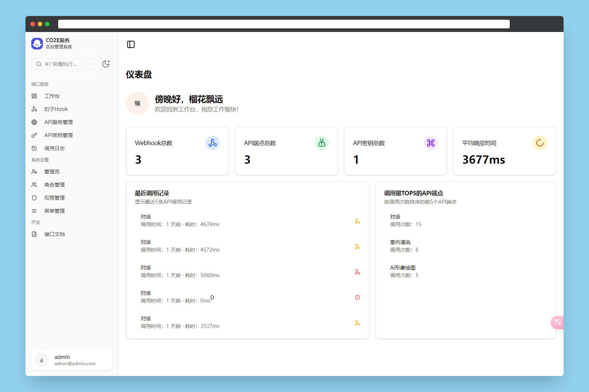
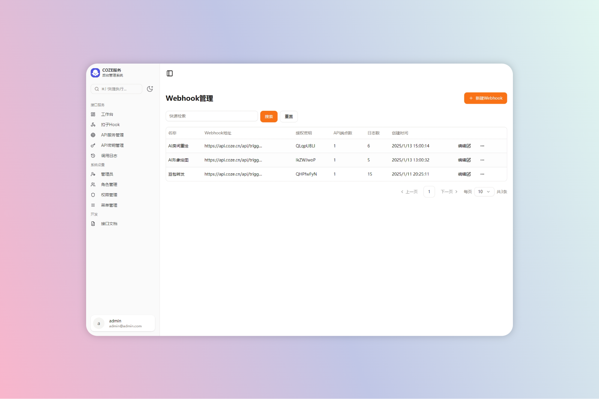
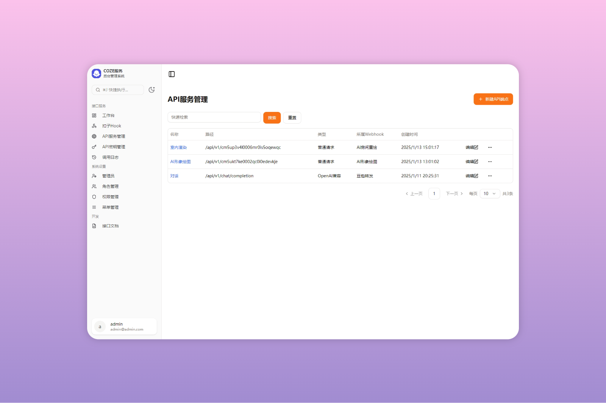
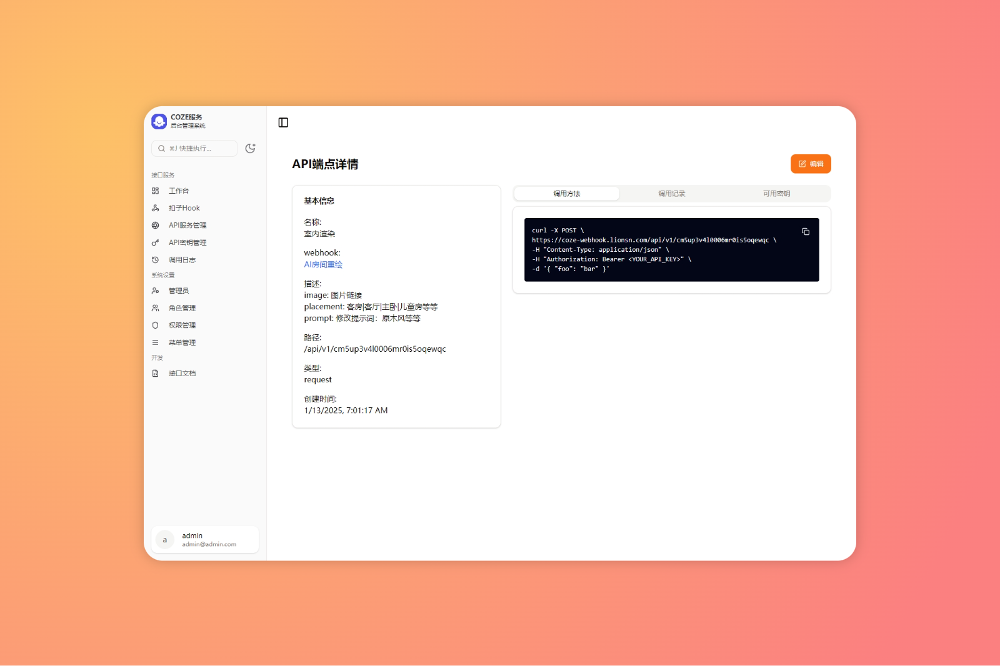
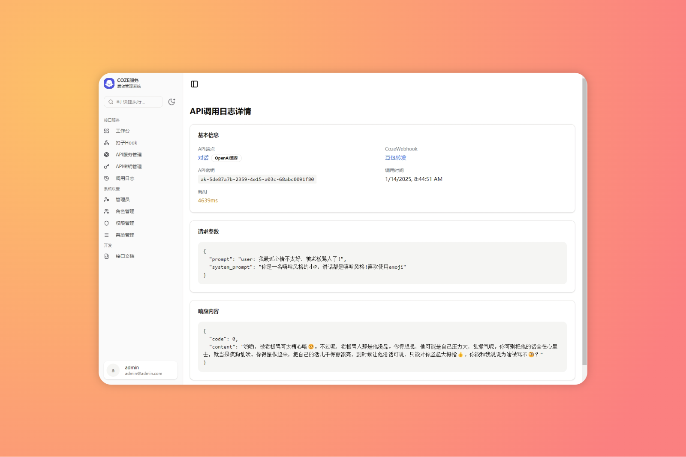
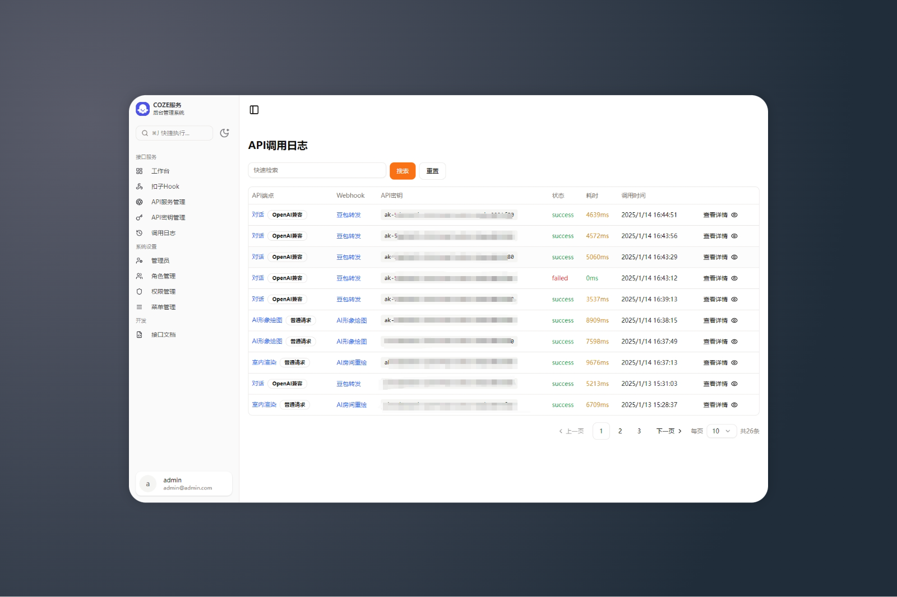

# 🚀 COZE 管理端

欢迎来到 **COZE 管理端**，这是一个功能强大的管理系统，旨在帮助您轻松管理 **Coze Webhook** 服务、API 端点、API 密钥以及相关的调用日志。无论您是开发者还是管理员，COZE 管理端都能为您提供高效、便捷的管理体验。

## 📖 英文文档

如果您需要查看英文文档 [这里](./README_EN.md)。

---

**Note**: The English documentation is available [here](./README_EN.md).

## 🌟 项目简介

COZE 管理端是一个基于 **Next.js 15**、**React 19**、**TypeScript** 和 **Prisma** 构建的现代化管理系统。它提供了丰富的功能模块，包括：

- **Webhook 管理**：创建、编辑、删除 Webhook，并监控其调用状态。
- **API 端点管理**：管理 API 端点，支持 OpenAI 兼容和普通请求两种类型。
- **API 密钥管理**：生成和管理 API 密钥，控制 API 端点的访问权限。
- **调用日志**：记录和查看 API 调用的详细日志，包括请求参数、响应结果和调用耗时。
- **管理员与权限管理**：管理管理员账户、角色和权限，确保系统的安全性。

## 🛠️ 技术栈

- **前端框架**: [Next.js 15](https://nextjs.org/)
- **UI 组件库**: [Shadcn UI](https://ui.shadcn.com/) 和 [Radix UI](https://www.radix-ui.com/)
- **样式**: [Tailwind CSS](https://tailwindcss.com/)
- **状态管理**: React 19 内置状态管理
- **数据库**: [Prisma](https://www.prisma.io/) 和 SQLite
- **认证**: [NextAuth.js](https://next-auth.js.org/)
- **API 路由**: Next.js API 路由
- **工具**: [Vercel AI SDK](https://vercel.com/docs/ai-sdk) 用于 AI 集成

## 🚀 快速开始

### 1. 克隆仓库

```bash
git clone https://github.com/liuhuapiaoyuan/coze-webhook-admin.git
cd coze-webhook-admin
```

### 2. 安装依赖

```bash
pnpm install
```

### 3. 配置环境变量

复制 `.env.template` 文件并重命名为 `.env`，然后根据您的需求修改环境变量。

```bash
cp .env.template .env
```

### 4. 数据库迁移

使用 Prisma 进行数据库迁移：

```bash
pnpm db:migrate
```

### 5. 启动开发服务器

```bash
pnpm dev
```

### 6. 构建项目

```bash
pnpm build
```

### 7. 启动生产服务器

```bash
pnpm start
```

## 📂 项目结构

```plaintext
coze-webhook-admin/
├── docker/                  # Docker 相关配置
├── prisma/                  # Prisma 数据库模型和迁移
├── src/
│   ├── app/                 # Next.js 页面和路由
│   ├── components/          # 可复用的 UI 组件
│   ├── hooks/               # 自定义 React Hooks
│   ├── lib/                 # 工具函数和库
│   ├── service/             # 业务逻辑服务层
│   └── styles/              # 全局样式
├── .env.template            # 环境变量模板
├── .gitignore               # Git 忽略文件
├── package.json             # 项目依赖和脚本
├── prisma/schema.prisma     # Prisma 数据库模型
└── README.md                # 项目文档
```

## 📝 功能模块

### 1. **Webhook 管理**

- 创建、编辑、删除 Webhook。
- 监控 Webhook 的调用状态和日志。

### 2. **API 端点管理**

- 支持 OpenAI 兼容和普通请求两种类型的 API 端点。
- 管理 API 端点的调用权限和密钥。

### 3. **API 密钥管理**

- 生成和管理 API 密钥。
- 控制 API 端点的访问权限。

### 4. **调用日志**

- 记录和查看 API 调用的详细日志。
- 包括请求参数、响应结果和调用耗时。

### 5. **管理员与权限管理**

- 管理管理员账户、角色和权限。
- 确保系统的安全性和访问控制。

## 🛡️ 安全性

- **认证与授权**: 使用 NextAuth.js 进行用户认证和授权管理。
- **API 密钥**: 所有 API 调用都需要有效的 API 密钥。
- **日志记录**: 所有 API 调用都会被记录，便于审计和排查问题。

## 🤝 贡献指南

我们欢迎任何形式的贡献！如果您有任何建议或发现任何问题，请随时提交 Issue 或 Pull Request。

1. **Fork 项目**: 首先 Fork 本项目到您的 GitHub 账户。
2. **创建分支**: 为您的功能或修复创建一个新的分支。
3. **提交更改**: 提交您的更改并推送到您的分支。
4. **提交 Pull Request**: 创建一个 Pull Request，描述您的更改。

## 界面截图








## 📄 许可证

本项目采用 [MIT 许可证](LICENSE)。

## 🙏 致谢

感谢所有为该项目做出贡献的开发者！特别感谢以下开源项目：

- [Next.js](https://nextjs.org/)
- [Prisma](https://www.prisma.io/)
- [Tailwind CSS](https://tailwindcss.com/)
- [Shadcn UI](https://ui.shadcn.com/)

---

希望您喜欢使用 **COZE 管理端**！如果您有任何问题或建议，请随时联系我们。😊
